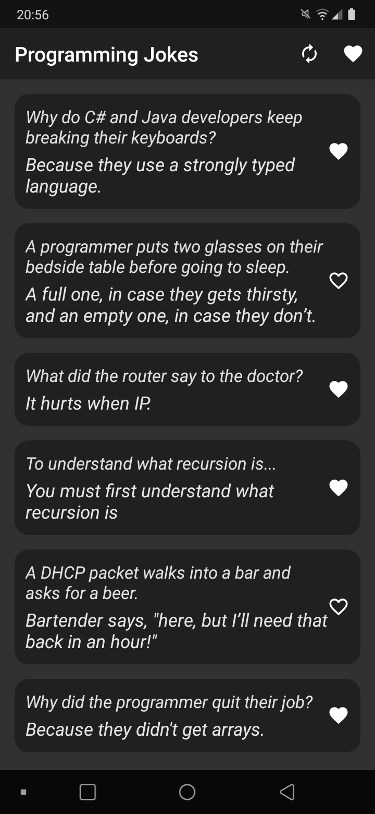
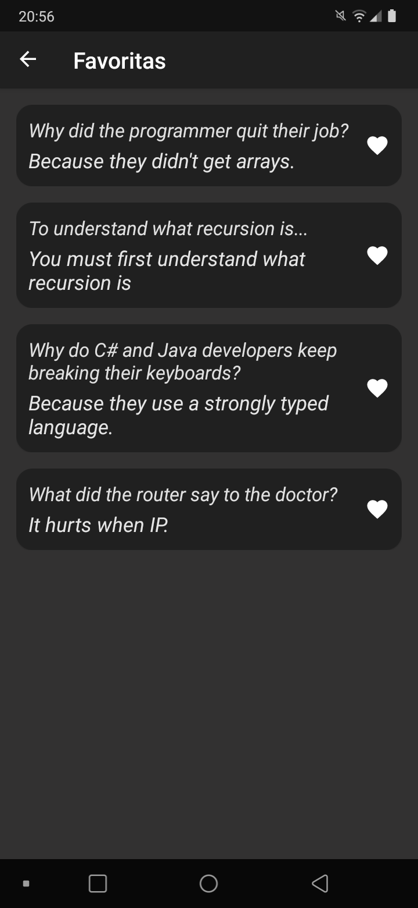

  
  

# Objetivo Principal

Projeto criado com o objetivo de estudar e implementar conceitos de **Clean Architecture** juntamente com **MVVM** no Android.

O app faz consumo da API [KarlJoke](https://github.com/eklavyadev/karljoke), tendo como funcionalidades principais listar piadas de programação e também adicionar/remover piadas de uma lista de favoritos.

Juntamente com o estudo de arquitetura limpa, também foi utilizada a biblioteca [Koin](https://github.com/InsertKoinIO/koin) para injeção de dependências, com o objetivo de aprender mais sobre ela, uma vez que costumo utilizar mais a biblioteca [Hilt](https://developer.android.com/training/dependency-injection/hilt-android).

# O que aprendi com este projeto...

### MVVM vs Clean Architecture

Apesar da arquitetura **MVVM** suprir a maioria das necessidades de projetos pequenos (como este próprio, caso fosse feito com o único intuito de funcionar com uma certa separação de responsabilidades), as coisas podem ficar um pouco mais complexas quando se trata de projetos de médio a grande porte.
A separação de camadas e suas responsabilidades que a *clean architecture* oferece traz muitas vantagens em relação ao uso somente da *MVVM*.

Pelo que pude perceber, é comum ver a clean architecture no Android sendo implementada em módulos separados pelas camadas principais ou até mesmo por features, que por sua vez também podem possuir suas próprias camadas de **data, domain** e **presentation**. Optei por não fazer nenhuma dessas duas coisas nesse projeto por não achar necessário, já que é um projeto simples de estudo e aumentaria ainda mais a complexidade.

Acredito que ___*clean architecture* e *MVVM* podem trabalhar muito bem juntas___.

### Facilidade de mudanças em camadas

Como o projeto está agora, a camada de apresentação (**presentation**) poderia facilmente ser alterada sem que afetasse ou houvesse a necessidade de modificar as demais camadas.
A alteração nesse caso poderia ser feita para substituir o **XML** pelo **Jetpack Compose**, por exemplo. Tudo seria feito unicamente na camada de *presentation*.

ViewModels dependendo de **use cases** ao invés dos próprios **repositories** em si me parece uma ideia interessante não apenas do ponto de vista de testes ou isolamento de responsabilidade única para cada caso de uso do app, mas também do ponto de vista de **clean code**, uma vez que fica bem mais claro o que cada ViewModel pode fazer baseado nos casos de uso que ele depende.

### Mas...

Como nem tudo são flores, a implementação e separação de cada camada (assim como a criação de todos os casos de uso) exige um certo esforço, o que pode acabar soando um pouco como [overengineering](https://en.m.wikipedia.org/wiki/Overengineering) em projetos que não exijam tanta complexidade. Acredito que seja algo a se analisar em cada projeto.

## App de demonstração

Se você desejar, pode testar o app criado nesse projeto baixando-o nas [releases](https://github.com/jsericksk/Programming-Jokes/releases).

## Bibliotecas utilizadas

- [Navigation Component](https://developer.android.com/guide/navigation/navigation-getting-started)
- [Koin](https://github.com/InsertKoinIO/koin)
- [Room](https://developer.android.com/training/data-storage/room)
- [Retrofit](https://github.com/square/retrofit)
